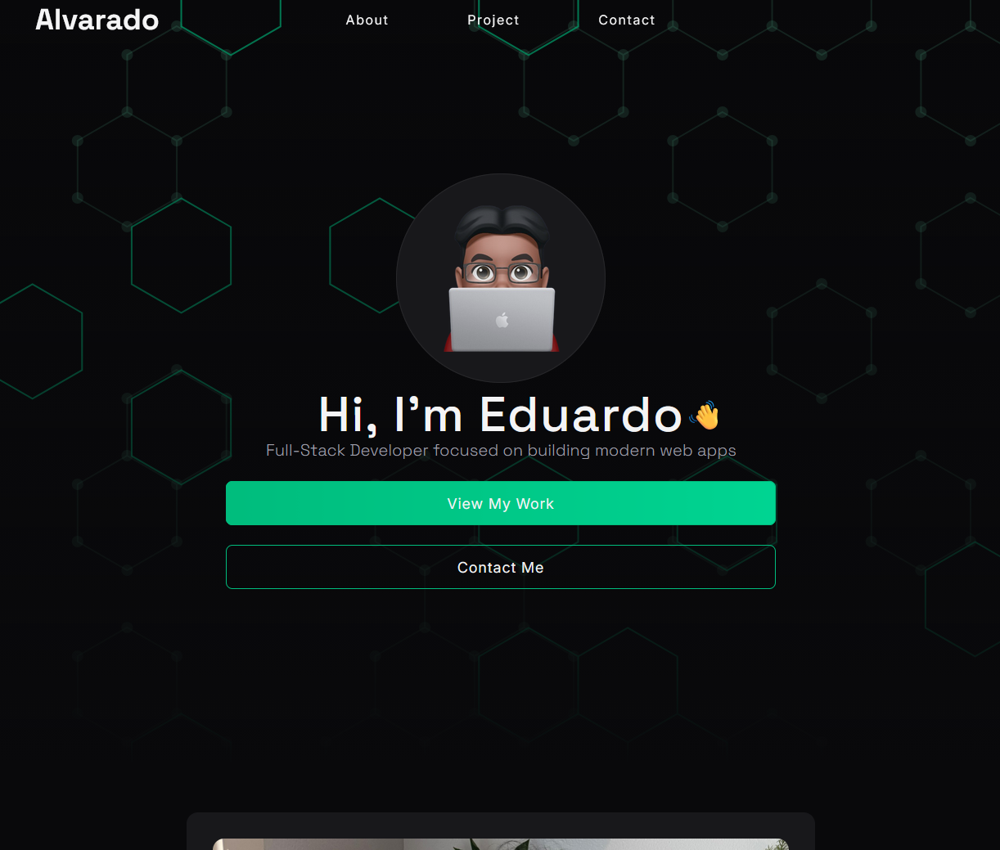
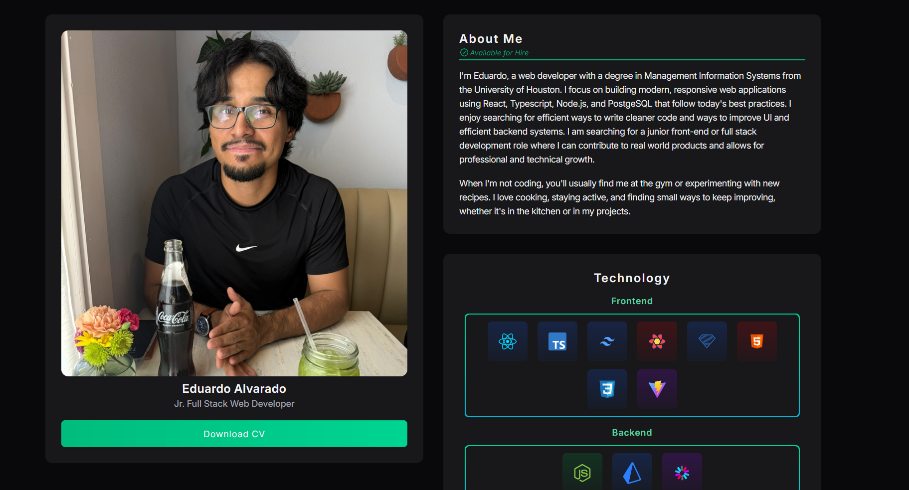
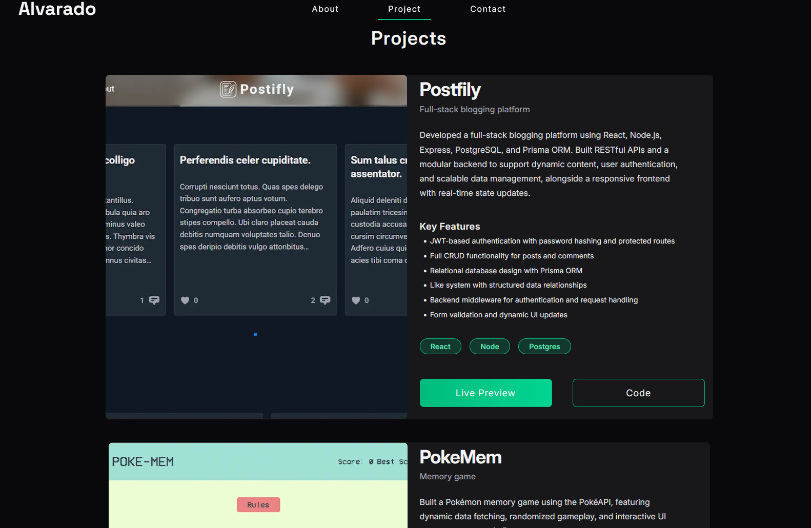

# Devfolio
A modern Full Stack Web Developer Portfolio Website built with React, Typescript, and Tailwind CSS to showcase my skills, projects, and experience as a web developer.

Live Demo: [ealvara73.com](https://www.ealvara73.com/)

# Local Install
1. Clone the repo
```
git clone https://github.com/username/devfolio.git
cd devfolio
```
2. Install Dependencies
```
npm install
```
3. Run the server
```
npm run dev
```


# Preview
### Hero


### About


### Projects


# Featured Projects
- [Postifly](https://github.com/ealvara6/blog-post)
- [PokeMem](https://github.com/ealvara6/Poke-Mem)
- [BattleShip](https://github.com/ealvara6/battleship)

# Features
- Responsive design for desktop and mobile
- Smooth scrolling navigation
- Animated section reveals
- Project showcases
- Skills and technology overview
- Contact form with Social links

## Frontend
- React
- Typescript
- Tailwind CSS
- Vite

## libraries
- shadcn/ui
- Lucide React
- Heroicons

# Design Goals
This project was developed with a focus on:
- Clean visual heiarchy
- Accessibility
- Responive Layouts
- Modern UI/UX principles
